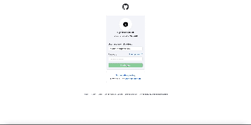
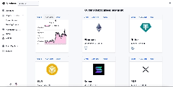
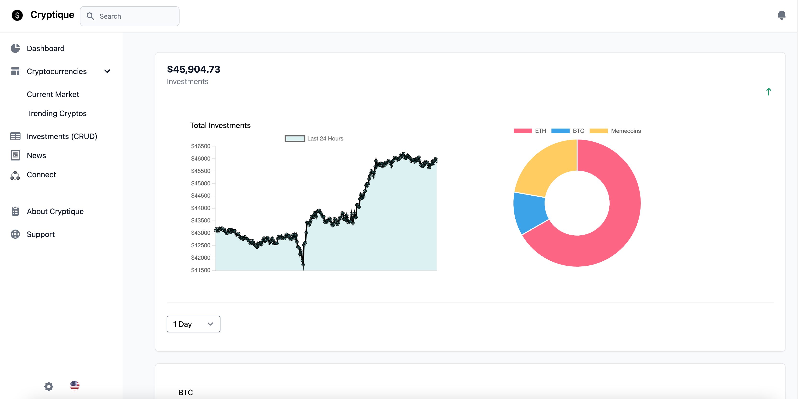

Cryptique

To start app in dev mode:
```
npm run dev
```


Tech used in this app:
- Language: JavaScript, TypeScript
- Frontend: React, Webpack, TailwindCSS, Flowbite, SCSS, Chart.js, React Router (v6), OAuth2.0
- Backend: Express.js (Node.js), PostgreSQL, MongoDB
- Testing: Jest, React Testing Library 
- Microservices: AWS Copilot (Amazon ECR/ECS), Docker


<br><br>
<div align="center">
  
</div>

<br><br>
<div align="center">
  
</div>


<br><br>



<br><br>
<video width="320" height="240" controls>
  <source src="./client/assets/readme/login-cryptique.mp4" type="video/mp4">
</video>
