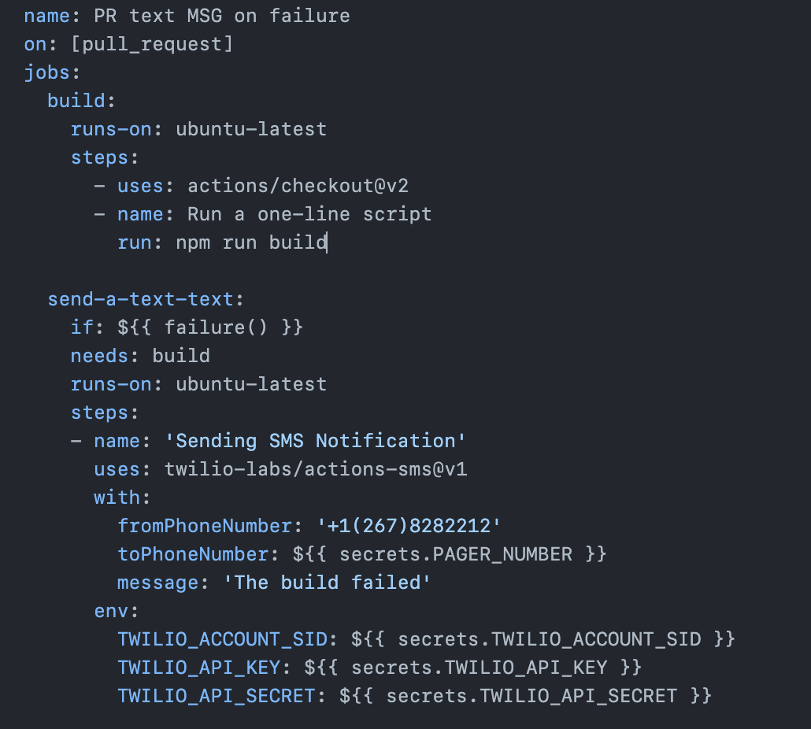

https://www.notion.so/Github-Actions-CI-CD-Workflow-Codes-7bbc92485aa344f4b5734e3eed576313?pvs=25

Publishing packages: https://docs.github.com/en/actions/publishing-packages/publishing-nodejs-packages

https://jcdan3.medium.com/4-ways-to-speed-up-your-github-action-workflows-a0b08067a6c6

- Caching dependencies for speeding up pipeline: Caching allows your workflow to store data for future uses, limiting the time spent downloading and making requests. For instance, if you use a package manager like npm and on every run, you need to get the same dependency, you should cache it. 

One way to do this is by using the actions/cache@v2 action.

```
- uses: actions/cache@v2
  with:
    path: ~/.cache/pip
    key: ${{ runner.os }}-pip-${{ hashFiles('**/requirements.txt') }}
    restore-keys: |
      ${{ runner.os }}-pip-
```

- If you don’t need windows specific libraries or dependencies, select Ubuntu since it’s will likely be faster (or at least test it).


- Strategy Matrix: The matrix allows you to test many (up to 256) version configurations for the same job. These configs can be of a language, framework, OS, etc.
A simple example would be if you need to run your unit tests for your Python on Windows and Linux. 
- And these tests, they need to pass on Python 3.6 and Python 3.9. In this case, you would gain from using the strategy matrix, up to 4x faster!

```
jobs:
  build:
    strategy:
      matrix:
        os: [ubuntu-latest, windows-latest]
        python: [3.6, 3.9]
```


Our current workflow for our CI/CD is: https://stackoverflow.com/questions/75352963/ci-cd-with-github-workflow-webpack-playwright-for-e2e-and-deploy-to-dedicated

PR from developer
Run eslint
Run unit tests
Webpack builds production environment with compression and minimization and leaves it in /dist
We take build to the artifacts (allows to pass to the next job and download it manually if necessary)
E2E job run
Grab build from artifacts
We created small server based on node express server, specially to run previously compiled /dist

npx playwright run ^
Put reports to artifacts
Deploy job


Github Actions CI: https://docs.github.com/en/actions/using-workflows/triggering-a-workflow

- A CI pipeline runs when code changes and should make sure all of your changes work with the rest of the code when it’s integrated. It should also compile your code, run tests, and check that it’s functional. A CD pipeline goes one step further and deploys the built code into production.


- npm ci is fast—in some cases, twice as fast as using npm i, representing a significant performance improvement for all developers using continuous integration.

ESLint: https://github.com/marketplace/actions/lint-action
```
name: Lint

on:
  # Trigger the workflow on push or pull request,
  # but only for the main branch
  push:
    branches:
      - main
  pull_request:
    branches:
      - main

jobs:
  run-linters:
    name: Run linters
    runs-on: ubuntu-latest

    steps:
      - name: Check out Git repository
        uses: actions/checkout@v2

      - name: Set up Node.js
        uses: actions/setup-node@v1
        with:
          node-version: 12

      # ESLint and Prettier must be in `package.json`
      - name: Install Node.js dependencies
        run: npm ci

      - name: Run linters
        uses: wearerequired/lint-action@v2
        with:
          eslint: true
          prettier: true
```


Lighthouse: https://www.foo.software/docs/lighthouse-check-github-action/examples#save-html-reports-to-aws-s3-slack-notifications-and-pr-comments
```
name: Test Lighthouse Check
on: [pull_request]

jobs:
  lighthouse-check:
    runs-on: ubuntu-latest
    steps:
      - uses: actions/checkout@master
      - run: mkdir -p ${{ github.workspace }}/tmp/artifacts
      - name: Run Lighthouse
        uses: foo-software/lighthouse-check-action@master
        with:
          awsAccessKeyId: ${{ secrets.LIGHTHOUSE_CHECK_AWS_ACCESS_KEY_ID }}
          awsBucket: ${{ secrets.LIGHTHOUSE_CHECK_AWS_BUCKET }}
          awsRegion: ${{ secrets.LIGHTHOUSE_CHECK_AWS_REGION }}
          awsSecretAccessKey: ${{ secrets.LIGHTHOUSE_CHECK_AWS_SECRET_ACCESS_KEY }}
          gitAuthor: ${{ github.actor }}
          gitBranch: ${{ github.ref }}
          gitHubAccessToken: ${{ secrets.LIGHTHOUSE_CHECK_GITHUB_ACCESS_TOKEN }}
          outputDirectory: ${{ github.workspace }}/tmp/artifacts
          urls: 'https://www.foo.software,https://www.foo.software/contact'
          sha: ${{ github.sha }}
          slackWebhookUrl: ${{ secrets.LIGHTHOUSE_CHECK_WEBHOOK_URL }}
```


CREATE RELEASES:
https://github.com/MylesBorins/node-osc/blob/main/.github/workflows/create-release.yml

```
on:
  push:
    tags:
      - 'v*'

name: Create Release

jobs:
  publish-to-npm:
    name: Publish to npm
    runs-on: ubuntu-latest
    permissions:
      id-token: write
    steps:
    - name: Checkout source
      uses: actions/checkout@v3
    - name: Setup node
      uses: actions/setup-node@v3
      with:
        node-version: 18
        registry-url: 'https://registry.npmjs.org'
        cache: npm
    - name: Install latest npm version
      run: npm install -g npm@latest
    - name: Install dependencies and build
      run: npm ci
    - name: Publish package
      run: npm publish --provenance
      env:
        NODE_AUTH_TOKEN: ${{ secrets.NPM_TOKEN }}

  create-github-release:
    name: Create GitHub Release
    runs-on: ubuntu-latest
    needs: publish-to-npm
    permissions:
      contents: write
    steps:
      - name: Checkout code
        uses: actions/checkout@v3
      - name: Create Release
        run: gh release create ${{ github.ref }} --generate-notes
        env:
          GITHUB_TOKEN: ${{ secrets.GITHUB_TOKEN }}
```


TEXT MESSAGE USING TWILIO ON FAILURE: https://github.blog/2021-11-18-7-advanced-workflow-automation-features-with-github-actions/




Docker: Test before Push Docker Image: https://docs.docker.com/build/ci/github-actions/test-before-push/
- https://docs.docker.com/build/ci/github-actions/test-before-push/
- Build and export the image to Docker
- Test your image
- Multi-platform build and push the image

```
name: ci

on:
  push:
    branches:
      - "main"

env:
  TEST_TAG: user/app:test
  LATEST_TAG: user/app:latest

jobs:
  docker:
    runs-on: ubuntu-latest
    steps:
      -
        name: Checkout
        uses: actions/checkout@v3
      -
        name: Set up QEMU
        uses: docker/setup-qemu-action@v2
      -
        name: Set up Docker Buildx
        uses: docker/setup-buildx-action@v2
      -
        name: Login to Docker Hub
        uses: docker/login-action@v2
        with:
          username: ${{ secrets.DOCKERHUB_USERNAME }}
          password: ${{ secrets.DOCKERHUB_TOKEN }}
      -
        name: Build and export to Docker
        uses: docker/build-push-action@v4
        with:
          context: .
          load: true
          tags: ${{ env.TEST_TAG }}
      -
        name: Test
        run: |
          docker run --rm ${{ env.TEST_TAG }}
      -
        name: Build and push
        uses: docker/build-push-action@v4
        with:
          context: .
          platforms: linux/amd64,linux/arm64
          push: true
          tags: ${{ env.LATEST_TAG }}
```
